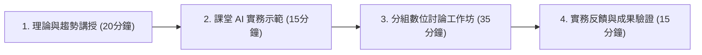

# 18週《AI 時代的創意發想與微型創業：Antigravity、AI Agent 與 Vibe Coding 實踐》課程教學大綱

> **課程定位**：企管系通識/跨領域專業選修・一般教室授課・學生課堂免自備電腦・著重思維建構、開源方法論與商業實務  
> **教學架構**：**理論與趨勢講授（20分鐘）＋ 課堂 AI 實務示範（15分鐘）＋ 分組數位討論工作坊（35分鐘）＋ 期中提案與期末專案發表**  
> **核心目標**：以學術嚴謹度結合前瞻應用，聚焦於 **Vibe Coding（自然語言人機互動典範）** 與 **結構化提示詞工程（Prompt Engineering）**。引導學生掌握「產品經理（PM）」思維，藉由自主智能體（AI Agent）將創新概念轉化為具備商業可行性之微型創業企劃，並於期末運用 Antigravity 免費額度產出單檔案專案網頁，免費託管至 GitHub Pages 供全球公開瀏覽。

---

## 一、課程教學模式架構

---

## 二、18 週主題、教學內容與分組討論進度對照表

| 週次 | 單元主題 | 教師講授與 AI 實務示範重點 | 學生分組研討實作（數位工作表） | 專案進度與考核 (Milestone) |
| :---: | :--- | :--- | :--- | :--- |
| **01** | **AI Agent 協同新典範：Vibe Coding 理念與自然語言互動思維** | 介紹 Andrej Karpathy 之 Vibe Coding 典範；演示以自然語言對話直覺引導 Antigravity 建構概念模型與界面原型 | 小組數位破冰：探討生活與學習中的體驗缺口，嘗試以抽象意境描述理想解決方案 | 建立AI Agent 協同創新思維與探索信心 |
| **02** | **自主智能體（AI Agent）演進：從對話式檢索到自主任務規劃** | 剖析普林斯頓與 Google 之 ReAct 框架（Thought-Action-Observation）；演示 Agent 工具調用、自我反思與自主任務規劃 | 繪製《AI 助理職能規劃表》：為團隊界定 3 個核心任務之目標、可用工具與驗證準則 | 理解智能體之自主性與環境反饋機制 |
| **03** | **結構化提示詞工程（Prompt Engineering）：多維指令架構** | 解構標準結構化提示詞框架：角色（Role）、背景脈絡（Context）、任務指令（Task）、約束邊界（Constraints）、輸出格式（Format） | 提示詞重構工作坊：將模糊口語改寫為具備邊界與格式要求的五維提示詞規格書 | 掌握高階自然語言提示詞工程架構 |
| **04** | **市場需求洞察與團隊組建：痛點分析與專案選題** | 設計思考發想流程：痛點發掘與聚焦定義；演示以 AI 擴散生活痛點並收斂為聚焦問題陳述（POV） | **【分組組隊】** 4~5人一組，依據痛點矩陣確立微型創業題目與目標受眾痛點 | **【專案啟動】** 確立創業專案主題與痛點界定 |
| **05** | **使用者同理與需求挖掘：同理心地圖與痛點優先級** | 深入拆解同理心地圖四大象限（說、想、做、感受）；演示 Antigravity 模擬極端使用者訪談與痛點挖掘 | 小組繪製《目標客群同理心地圖》：辨識使用者最深層的痛點（Pains）與渴望（Gains） | 具體描繪目標受眾真實心理模型 |
| **06** | **創意發想與概念收斂：Crazy 8s 與 HMW 提問法** | 借鑑 Google Design Sprint「How Might We」（我們如何能夠）與「瘋狂八分鐘（Crazy 8s）」快速發想概念 | 團隊進行 Crazy 8s：每人 8 分鐘發想 8 個概念，並由全組線上投票收斂出最優解 | 產出專案最具顛覆性的核心解決方案 |
| **07** | **商業模式畫布（BMC）：九大模組架構與價值主張** | 完整解析 Strategyzer Business Model Canvas（商業模式九宮格）；演示以 AI 檢索產業競爭格局並填寫畫布模組 | 小組合作填寫《創業專案商業模式九宮格》：重點界定價值主張、客群與關鍵合作夥伴 | 完成商業模式全景架構規劃 |
| **08** | **精實創業與最小可行性產品（MVP）：低成本驗證策略** | Eric Ries《精實創業》核心心法：建構—衡量—學習循環（Build-Measure-Learn）；解構六大 MVP 原型（冒煙測試、綠野仙蹤等） | 設計小組專案的《MVP 驗證方案》：定義最關鍵假設（Riskiest Assumption）與衡量指標 | 確立以最低成本驗證商業構想之路徑 |
| **09** | **【期中報告】精實商業提案發表（Lean Pitch）與同儕互評** | 提案結構與演說規範指引；挑選代表性提案由教師輸入 Antigravity 進行即時可行性剖析 | **【期中報告發表】** 進行 3 分鐘精實提案口頭發表與企劃審查，全班實施線上同儕互評 | **【期中考核 30%】** 精實商業提案口頭發表與企劃書審查 |
| **10** | **品牌定位與視覺語義：品牌原型與情感共鳴** | 榮格 12 品牌原型（Brand Archetypes）；演示如何將品牌價值轉譯為具體的提示詞風格指引、配色規格與 Slogan | 撰寫《品牌核心規格書》：挑選團隊品牌原型，定義品牌個性、語氣指引與主副色彩代碼 | 確立鮮明的品牌辨識度與情感價值 |
| **11** | **顧客旅程地圖（CJM）與服務接觸點設計** | 借鑑 Nielsen Norman Group (NN/g) 顧客旅程五階段（知曉、考慮、購買、使用、擁護）；演示服務藍圖優化 | 繪製《專案顧客旅程地圖》：標註關鍵接觸點（Touchpoints）、情緒起伏與服務機會點 | 打造流暢且具黏著度之顧客服務流程 |
| **12** | **多智能體協同架構（Multi-Agent System）：虛擬創業團隊** | 多智能體框架理論（CrewAI / AutoGen 概念）；演示 Antigravity 子特工在產品、行銷與客服角色的自動化分工協作 | 規劃小組《虛擬組織架構圖》：配置 3 類虛擬員工 Agent，定義職責清單與協同 SOP | 建立具備高延展性之虛擬營運團隊 |
| **13** | **整合行銷傳播（IMC）與 AIDA 轉換漏斗** | AIDA 銷售漏斗（注意、興趣、慾望、行動）；演示如何引導 AI 生成符合漏斗不同階段的行銷文案矩陣 | 制定小組《一頁式數位行銷矩陣》：針對不同接觸管道規劃專屬內容主題與促購行動召喚（CTA） | 完成數位行銷推廣策略之系統化佈局 |
| **14** | **AI 倫理、法規與防禦性工程：安全可靠的創業基石** | 歐盟 AI 法案（EU AI Act）風險分級與 OWASP Top 10 for LLMs；探討 Prompt Injection 防禦與「AI Agent 協同治理（HITL）」底線 | 制定小組《AI 倫理與營運防護清單》：界定 AI 自動化界限、個資保護措施與緊急人工介入準則 | 建立合規、安全且具社會責任之營運機制 |
| **15** | **【期末實戰】數位原型實踐（一）：利用 Antigravity 生成專案網站** | 介紹單檔案無建置架構（HTML5 + Tailwind CSS CDN + Lucide Icons）；演示如何將商業企劃書轉譯為 Antigravity 生成提示詞 | 小組規劃數位工作表《一頁式專案網站架構草圖》：包含導航欄、英雄區、特色卡片、定價與 CTA | 產出專案網站完整架構與提示詞規格 |
| **16** | **【期末實戰】數位原型實踐（二）：GitHub Pages 平台部署實務發布** | **【免安裝免指令實踐】** 示範透過 GitHub 網頁版上傳 index.html，啟用 GitHub Pages 免費託管服務取得公開 HTTPS 網址 | 小組依循教學步驟指引，課後利用免費額度上線網頁，並於課堂交流測試網址相容性 | 專案網站正式上線，取得對外公開連結 |
| **17** | **【期末實戰】系統整合與成效驗證：提案簡報與展示網站串聯彩排** | 整合設計思考、商業模式畫布、MVP 驗證數據與 GitHub Pages 專案網站；解析 3 分鐘創業簡報（Pitch Deck）黃金架構 | 小組進行期末提案全流程彩排：分配口頭報告與網頁即時展示動線，接受教師現場調優指導 | 完成期末發表前之最終準備與壓力測試 |
| **18** | **【期末大會】Demo Day 成果發表會：網頁成果公開展示與競演** | 正式 Demo Day：各組依序進行 3 分鐘提案 ＋ 1 分鐘網頁即時操作 ＋ 2 分鐘評審答辯；全班進行同儕線上即時評選 | 全班同學以手機瀏覽各組 GitHub Pages 專案網站，給予實名回饋與投資意向票選；評選最佳專案 | **【學期總驗收】** 綜合評審與優秀創業專案表揚 |

---

## 三、評分標準（課堂手機互動協作、期末成果公開驗證）
1. **課堂互動與分組研討表現（30%）**：
   - 隨堂線上快測與觀念檢核（10%）
   - 課堂小組數位工作表與研討成果（15%）
   - 課堂提問與發言互動表現（5%）
2. **期中商業提案報告（30%）**：
   - 第 9 週【期中報告】精實商業提案發表（Lean Pitch 簡報與企劃書）（20%）
   - 問題定義、商業模式九宮格、同理心地圖與 MVP 方案之完整性（10%）
3. **期末專案成果發表與網站展示（40%）**：
   - 微型創業企劃完備度與商業可行性（15%）
   - 專案展示網站建置成果與 GitHub Pages 公開上線互動性（15%）
   - Demo Day 成果發表答辯台風與團隊協同流暢度（10%）
4. **【榮譽加分條款】**：考取經濟部 iPAS「品牌規劃師」或 iPAS「AI 應用規劃師」專業能力鑑定，或以本課程成果報名參加校內外創新創業競賽者，給予學期總成績加 5~10 分！