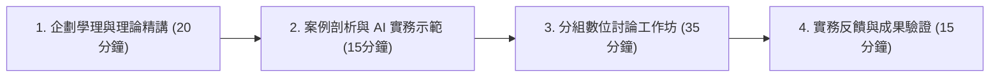

# 18週《創意發想與實踐：曾光華行銷企劃、創意方法學與 AI Agent 微型創業》課程教學大綱

> **課程定位**：企管系專業核心與跨領域選修・一般教室授課・學生課堂免自備電腦・著重企劃學理、創意思維與商業實務  
> **教學架構**：**理論與企劃學理精講（20分鐘）＋ 實務案例與 AI 協同示範（15分鐘）＋ 分組數位討論工作坊（35分鐘）＋ 期中提案與期末專案發表**  
> **核心目標**：以國立中正大學行銷學名譽教授 **曾光華 博士《行銷企劃：邏輯、創意、執行力（第五版）》** 10 大章節為學理骨幹，融會貫通創意發想技術（逆向假設法、全新情境法、加減乘除移五法、六頂思考帽）。引導學生以「產品經理（PM）」思維，結合現代 AI Agent 協同工具，將創意構想轉化為具備商業可行性之微型創業企劃，並於期末產出單檔案商務網頁，免費託管至 GitHub Pages 供全球公開瀏覽。

---

## 一、課程教學模式架構

---

## 二、18 週主題、曾光華教材章節與分組進度對照表

| 週次 | 單元主題 | 曾光華《行銷企劃 5e》對應章節與教學重點 | 學生分組研討實作（數位工作表） | 專案進度與考核 (Milestone) |
| :---: | :--- | :--- | :--- | :--- |
| **01** | **AI Agent 協同新典範：Vibe Coding 理念與自然語言互動思維** | *（第一週已講授完畢，完整維持原始教學紀錄）* | 小組數位破冰：探討生活與學習中的體驗缺口，嘗試以抽象意境描述理想解決方案 | 建立 AI 協同創新思維與探索信心 |
| **02** | **行銷企劃的本質：邏輯、創意、執行力三大支柱與思考機制** | **【CH01 行銷企劃的本質】** 剖析企劃品質三大支柱（邏輯、創意、執行力）；AI 時代學企劃之必要性；企劃程序五步驟與 ReAct 思考機制 | 填寫《專案三大支柱檢核表》：盤點小組專案的邏輯前提、創意亮點與初期執行時程 | 樹立專業企劃師思維，告別狂想、平庸與空想 |
| **03** | **行銷企劃目標：問題界定、機會洞察與具體生動的目標設定** | **【CH02 行銷企劃目標】** 策略層次 vs 技術層次問題；行銷機會種類；企劃目標三要素；四個設定途徑；將「圖像與感覺」帶入企劃目標 | 撰寫《有生命力的企劃目標規格書》：運用 CLEAR 框架界定核心真因，描摹感動願景 | 確立清晰具體且激勵人心的專案目標 |
| **04** | **外部環境分析：PESTC 矩陣辨認機會與威脅，撰寫具說服力的企劃背景** | **【CH03 外部環境分析】** 外部分析與企劃說服力；微故事企劃背景撰寫法；PESTC 總體環境與競爭矩陣；消費者心理與動機分析 | 繪製《PESTC 機會威脅矩陣》並撰寫 150 字極具五感體驗的專案企劃背景微故事 | 確立外部環境憑據，奠定企劃說服力基石 |
| **05** | **內部環境分析：優劣勢檢核、定位導向與 SWOT 交叉策略推演** | **【CH04 內部環境分析】** 知己才能提升執行力；優劣勢檢核表四大構面；以消費者角度誠實檢核；SWOT 交叉分析（SO/ST/WO/WT）行動矩陣 | 推演小組《SWOT 交叉策略表》：擬定核心 SO 強攻策略與 WT 避險防禦策略 | 確立差異化定位與團隊核心作戰方針 |
| **06** | **激發行銷企劃創意（上）：逆向假設分析法、全新情境法與加減乘除移五法** | **【CH05 激發行銷企劃創意（上）】** 影響創意三大因素（心理特質、專業職務、周邊資訊）；逆向假設分析法三步驟；加減乘除移五大基本技巧；全新情境法 | 進行《逆向假設創意工作坊》：挑戰專案中的傳統常規，構思 3 款前所未見的驚喜亮點 | 掌握系統化創意思考技術，打破心智枷鎖 |
| **07** | **激發行銷企劃創意（下）：六頂思考帽、團隊腦力激盪與避開兩大創意陷阱** | **【CH05 激發行銷企劃創意（下）】** 腦力激盪四大黃金原則；六頂思考帽色彩特性與切換節奏；避開「忽略理性紀律」與「閉門造車」兩大陷阱 | 演練《六頂思考帽決策會》：運用黑帽挑缺陷、白帽補數據、黃帽找價值、藍帽定案 | 建立高效團隊協同機制，確保創意切實可行 |
| **08** | **新產品上市行銷企劃（上）：創新層次、成敗關鍵與 STP 4P 整合架構** | **【CH06 新產品上市行銷企劃（上）】** 四類創新層次（革命性、改良式、局部、新定位）；新產品成敗關鍵；上市企劃三大支柱（目標客群、定位、4P 綜效） | 繪製《價值主張對齊畫布》與單頁 MVP 架構草圖，計算首波量化轉換目標 | 完成微型創業企劃方案之系統化整合 |
| **09** | **【期中報告】精實商業提案發表（Lean Pitch）與曾光華四大維度同儕審查** | **【CH01~CH06 期中成果總驗收】** 提案發表核心心態（任務是說服而非流水帳報告）；曾光華企劃審查四大維度（邏輯、創意、執行力、成本效益） | **【期中報告發表】** 每組 3 分鐘口頭提案路演，全班以手機進行即時同儕線上評審 | **【期中考核 30%】** 精實商業提案發表與企劃書審查 |
| **10** | **新產品上市經典案例剖析與借鏡：從 LOVEpet、蘆溪 LUCY 到 AI 思考力** | **【CH06 新產品上市行銷企劃（下）】** LOVEpet 寵健康 APP 盲點診斷（技術過度樂觀、獲利矛盾）；蘆溪 LUCY 地方創生老宅策展亮點；AI 思考力定位策略 | 填寫《專案盲點體檢與改進對策表》：借鏡經典案例排除小組專案潛在獲利與法律暗礁 | 深度復盤專案，提高商業抗風險能力 |
| **11** | **公關與事件行銷企劃：創造社會大眾話題，全聯母親節策展與文化傳播案例** | **【CH07 公關與事件行銷企劃】** 公關三大特色（高公信力、低防禦、戲劇化）；事件行銷兩大成功要件；全聯母親節美術館移法策展與笑出文化感案例 | 規劃《校園低成本快閃事件企劃》：設計話題主題、反差亮點與社群 IG/Threads 擴散動線 | 掌握話題營造與社群共振的槓桿力量 |
| **12** | **促銷企劃案：促銷特性、種類與防禦機制，保護品牌價值的實戰促銷設計** | **【CH08 促銷企劃案】** 促銷特性與種類；促銷陷阱與防禦機制（絕不傷害品牌價值）；屏東勝利星村購物節促銷案例；萊爾富銀髮族人情味促銷 | 設計《保護品牌價值的促銷方案》：規劃非價格型超值誘因，設定防呆風控底線 | 學會以驚喜感刺激購買，同時守護品牌利潤 |
| **13** | **其他類行銷企劃：愛心同行 Pass APP、LINE 在南故宮與諸羅藝文道案例分析** | **【CH09 其他類行銷企劃：案例與分析】** 跨域整合與非營利企劃；愛心同行 APP（擺脫悲情、共融生活平台、雙邊網絡）；LINE 在南故宮（高頻數位活化實體） | 繪製《跨域合作與數位接觸網絡圖》：鎖定校園互利夥伴，規劃通訊軟體與網頁串接 | 拓展跨界整合格局，打造自我生長生態圈 |
| **14** | **行銷企劃書撰寫與文字排版美學：掌握合理架構，徹底掃除八大文字毛病** | **【CH10 行銷企劃撰寫與簡報（上）】** 企劃品質三大支柱檢核表；文字明確俐落：掃除打轉繞圈、贅字冗詞等八大毛病；「圖表勝文字」排版規範與規格化美學 | 執行《企劃文筆無情大掃除》：落實「一意一句」原則，將長篇論述精煉為圖表與金句 | 打造專業俐落、易讀性極高的正式企劃書 |
| **15** | **說服型簡報設計與台前演出技巧：建立說服心態，精心設計內容與台風** | **【CH10 行銷企劃撰寫與簡報（下）】** 建立說服心態（非背誦朗讀）；聽眾與現場情境分析；簡報大字視覺化原則；台上精彩演出技巧（站姿、眼神、時間掌控） | 進行《3 分鐘說服口頭演說組內彩排》：磨練開場 30 秒抓人技巧，演練金字塔答辯公式 | 掌握演說說服力，展現成熟自信的台風 |
| **16** | **【期末實戰一】微型創業網頁原型實踐：以 Antigravity 將企劃落地為單頁商務網站** | **【企劃方案落地為真實商業網頁】** 整合 4P 行銷組合與產品定位，落實曾教授「執行力」哲學；單頁 HTML5 極簡架構；運用 CLEAR 框架引導 AI 生成完整網頁 | 小組完成《單一 index.html 商業網頁》：包含 Navbar、Hero、3 大特色卡片、定價與預約表單 | 構想化為現實，完成可操作之商業原型 |
| **17** | **【期末實戰二】GitHub Pages 全球公開發布部署與說服型 Demo 全流程彩排** | **【行銷傳播渠道正式啟用】** 免指令免安裝 3 步驟啟用 GitHub Pages 雲端託管取得 HTTPS 網址；手機 RWD 自適應與表單功能驗收；3+1 簡報網頁串聯彩排 | 完成《GitHub Pages 全球上線》並將網址登記至展示中心；接受教師現場預演調優指導 | 專案正式面向全球公開，做好發表萬全準備 |
| **18** | **【期末大會】微型創業 Demo Day 成果發表會：全景企劃展示、公開網頁驗收與全班競演** | **【學期微型創業發表與評審總驗收】** 各組 3 分鐘提案 ＋ 1 分鐘網頁即時展示 ＋ 2 分鐘答辯；曾光華四大維度驗收；全班即時線上評選與榮譽加分表揚 | 全體同學以手機瀏覽各組線上網頁，進行實名互評與人氣票選；總結學期成長與自豪感 | **【學期總驗收 40%】** 微型創業成果公開驗收表揚 |

---

## 三、評分標準（課堂手機互動協作、期末成果公開驗證）
1. **課堂出席表現（30%）**：
   - 全學期課堂出缺席考核（30%）：每週課堂落實點名與差勤考核，準時到課且無曠缺課即獲滿分，成績計算單純明確。
2. **期中商業提案報告（30%）**：
   - 第 9 週【期中報告】精實商業提案發表（Lean Pitch 簡報與企劃書）（20%）
   - 問題定義、商業模式九宮格、同理心地圖與 MVP 方案之完整性（10%）
3. **期末專案成果發表與網站展示（40%）**：
   - 微型創業企劃完備度與商業可行性（15%）
   - 專案展示網站建置成果與 GitHub Pages 公開上線互動性（15%）
   - Demo Day 成果發表答辯台風與團隊協同流暢度（10%）
4. **【榮譽加分條款】**：考取經濟部 iPAS「品牌規劃師」或 iPAS「AI 應用規劃師」專業能力鑑定，或以本課程成果報名參加校內外創新創業競賽者，給予學期總成績加 5~10 分！
