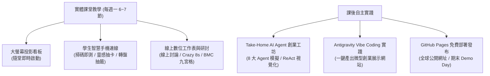

# 萬能科技大學【創意發想與實踐 ✕ Antigravity ✕ AI Agent】互動教學與微型創業實踐平台

**課程名稱：** 創意發想與實踐 (Creative Ideation and Practice) ｜ 2 學分 (每週 2 小時，全學期 36 小時)  
**課程代碼：** C0910009 ｜ **開課學期：** 11501 學期 (115學年度第1學期)  
**開課班級：** 企管四系1甲 (日間部 企業管理系 一年級甲班)  
**上課時段：** 每週一 第 6、7 節 (13:00 ~ 14:45)  
**授課地點：** G104 多媒體視聽教室 (一般視聽多媒體教室，**現場無學生電腦設備**)  
**授課教師：** 邱俊維 博士 (Dr. Chun-Wei Chiu) ｜ 企管系專案助理教授  
**研究室：** 育英樓 J801-1 ｜ **聯絡信箱：** `jimchiu@mail.vnu.edu.tw`  
**輔導考證：** 經濟部 iPAS「品牌規劃師」或「AI 應用規劃師」專業能力鑑定 ｜ 創新創業相關專業認證  

---

## 🌟 無電腦教室教學設計亮點：課堂手機即時互動 ✕ 線上數位協作 ✕ 課後 AI 實戰

針對日間部企管系一年級新鮮人在 **無桌上型電腦教室（僅有教學投影大螢幕）** 上課之環境特性，本平台落實以學習者為中心的互動教學規範，提供**「課堂手機即時互動 ✕ 線上數位工作表 ✕ 課後 AI 實戰」**之完整學習體系：



### 📱 課堂互動模式（智慧型手機即時連線 ✕ 數位工作表 ✕ iPAS 題庫練習）
1. **教室互動連線看板**：提供清晰的教室連線網址與 QR Code，全班同學使用智慧型手機掃碼即可連線參與，隨開即用。
2. **手機隨堂 5 題觀念快測**：每週下課前 5 分鐘在大螢幕同步開放快測，學生單手點選即時看精闢詳解與反思，輕鬆掌握當堂核心概念。
3. **微型創業靈感抽卡機 (Idea Deck)**：隨機抽取「目標客群 ✕ 核心痛點 ✕ AI Agent 技術 ✕ 創業場景」4 大元素，各組進行現場即興微型創業點子發想。
4. **創意大轉盤 / 隨機點名與分組抽籤機**：HTML5 Canvas 物理動態轉盤，隨機抽籤輪派發表組別與點名互動，活絡企管大一課堂氣氛。
5. **Crazy 8s / 討論倒數計時器**：預設 Crazy 8s (8分鐘)、快速破冰 (3分鐘)、腦力激盪 (5分鐘)、深入討論 (15分鐘)、Pitch (3分鐘)，內建 Web Audio 提示音效與視覺提示。
6. **6 大數位協作工作表專區**：完整內建六大工作表，包含 P-C-G-C-F 提示詞重構、痛點 POV 定義書、同理心 Persona、BMC 損益平衡、多特工配置與 Pitch Deck 8 頁架構，學生在手機端即可直接查閱與填寫！

### 🤖 課後自主模式（Take-Home Antigravity ✕ AI Agent 創業工坊）
學生課後回到宿舍或家中，無論使用個人筆電或手機，皆可自主打開本平台進行深度的商業邏輯推演與數位實踐：
1. **8 大微型創業專屬 AI Agent 工坊**：
   - **Agent 1：痛點雷達與 POV 問題定義 Agent**（實用設計思考痛點分級與問題陳述句收斂）
   - **Agent 2：目標受眾同理心地圖與 Persona 畫像 Agent**（Says/Thinks/Does/Feels 四象限與深層 Pains/Gains 刻畫）
   - **Agent 3：Crazy 8s 顛覆發想與 HMW 破局 Agent**（Google Sprint 破局提問與 8 個跨界創意收斂 Champion Idea）
   - **Agent 4：商業模式九宮格 (BMC) 診斷 Agent**（Strategyzer 9 大模組檢驗、閉環審查與損益兩平點試算）
   - **Agent 5：精實創業 MVP 驗證路徑 Agent**（冒煙測試 Smoke Test、假門實驗與 Build-Measure-Learn 指標）
   - **Agent 6：品牌 12 原型與視覺語義風格 Agent**（榮格 12 原型、Slogan、HEX 配色情緒板與 Tone of Voice）
   - **Agent 7：AIDA 全通路數位行銷矩陣 Agent**（Attention 黃金 3 秒開頭、Threads 爆款貼文、IG 限動與 LINE 推播）
   - **Agent 8：Antigravity Vibe Coding 一頁式網站生成 Agent**（一鍵轉譯為 Tailwind CSS CDN + 響應式 index.html 完整代碼）
2. **ReAct 思考推理視覺化**：擬真終端機動態呈現 **Thought (思考) ➔ Action (工具調用 Tool Calling) ➔ Observation (環境觀察) ➔ Decision (商業決策)**，體現新世代 Agentic AI 思考路徑。
3. **一鍵產出微型創業企劃書與單頁網站原始碼**：自訂參數後一鍵匯出一頁式企劃草案（支援 Markdown 與列印）及完整的 `index.html` 網頁原始碼。
4. **GitHub Pages 免費全球部署上線**：提供免終端機、免指令的純網頁版 5 步驟部署教學，1 分鐘取得全世界皆可造訪的專屬 HTTPS 網址，期末 Demo Day 成果公開展示！
5. **外部 AI 黃金 Prompt 複製庫**：一鍵複製專業規格提示詞，貼入免費版 ChatGPT、Google Gemini 或 Claude 進行更深入的對話迭代。

---

## 🎯 第一週導論與學期評分標準

### 👨‍🏫 授課教師個人檔案
- **授課教師：** 邱俊維 博士 (Dr. Chun-Wei Chiu)
- **現任職務：** 萬能科技大學 企業管理系 專案助理教授
- **研究室：** 育英樓 J801-1 ｜ **電子信箱：** `jimchiu@mail.vnu.edu.tw`
- **諮詢時間 (Office Hours)：** 每週一 15:00 ~ 16:00、週四 14:00 ~ 16:00 (敬請事先預約)
- **教學理念：** 創意思維不是玄學，而是「痛點洞察 ✕ 結構化表達 ✕ 快速原型驗證」的科學方法。在 Vibe Coding 與 Agentic AI 爆發的時代，你不需要是工程師，只要具備精準的自然語言邏輯與 PM 產品經理心態，就能指揮 AI 特工團隊將微型創業構想轉化為全球可瀏覽的數位作品！

### 📊 學期成績評分標準 (30 / 30 / 40 規範)
1. **課堂互動與分組研討表現 (30%)**：
   - 每週下課前手機隨堂 5 題觀念快測 (10%)。
   - 課堂小組數位工作表與研討成果 (15%)。
   - 大轉盤抽問、課堂發言與即席互動表現 (5%)。
2. **期中商業提案報告 (30%)**：
   - 第 9 週【期中報告】精實商業提案發表（Lean Pitch 簡報與企劃書審查）(20%)。
   - 痛點洞察 POV、商業模式畫布 (BMC)、同理心地圖與 MVP 方案之完整性 (10%)。
3. **期末專案成果發表與網站展示 (40%)**：
   - 商業提案邏輯與說服力 (15%)：問題定義清晰、價值主張明確、商業模式具備可持續性。
   - Antigravity 生成之 GitHub Pages 專案網站 (15%)：具備高質感視覺、明確 CTA、功能模組與全平台響應式體驗。
   - Demo Day 成果發表答辯台風 (10%)：3 分鐘精練 Pitch + 1 分鐘網頁即時展示 + 2 分鐘評審答辯。
4. **榮譽加分機制 (最高加學期總分 10 分)**：
   - 考取經濟部 iPAS「品牌規劃師」或「AI 應用規劃師」專業能力鑑定者給予學期總分 5~10 分加分。
   - 以本課程專案成果報名參加校內外創新創業競賽者給予專案加分。

---

## 🚀 老師上課使用說明（兩種啟動模式）

### 模式一：普通教室區域網路投影互動模式 (最推薦 👍)
1. 在教師教學主機上，直接雙擊點擊 **`啟動教學平台.bat`**。
2. 系統會自動啟動後端伺服器，並開啟預設瀏覽器進入 `http://localhost:5000`。
3. 平台右上角與「課堂互動工具」會自動生成**教室大螢幕專用 QR Code 與連線網址**（例如：`http://192.168.1.105:5000`）。
4. 請老師將該畫面投影至大螢幕，全班同學拿起智慧型手機掃描 QR Code 即可連線參與隨堂測驗、靈感抽卡與轉盤點名！

### 模式二：單機離線免安裝模式 (零外網環境備援 👍)
- 若教室網路不穩或電腦未安裝 Python，可直接雙擊打開 **`平台首頁(單機離線直接點開).html`**。
- 單一檔案完整內嵌 18 週教案、180 題全真題庫、8 大創業 Agent 與 6 份工作表，在任何電腦與手機瀏覽器皆可 100% 離線運行！

---

## 📂 系統目錄架構

```text
11501創意發想與實踐/
│  啟動教學平台.bat                <- 教學平台一鍵啟動批次檔 (支援本機/區域網路)
│  平台首頁(單機離線直接點開).html <- 零外網依賴單一離線全功能版 HTML (雙擊即開)
│  app.py                         <- Python Flask 後端伺服器 (具備自動偵測區域 IP 功能)
│  README.md                      <- 本系統操作手冊與教學指引
│  Full_Screen_Presentation.html  <- 18 週全功能全螢幕教學簡報系統
│  00_Course_Syllabus.md          <- 18 週完整教學大綱
│  99_Worksheets_and_Discussion_Guides.md <- 6 大課堂數位工作表手冊
│
├─data/
│      curriculum.json            <- 18 週課程地圖、教師檔案、評量規準、6大工作表
│      questions.json             <- 180 題全真結構化題庫 (含詳解、週次、模組、難度)
│      agent_templates.json       <- 8 大微型創業 AI Agent 實戰範本與 ReAct 軌跡
│
├─templates/
│      index.html                 <- 前端現代化響應式 UI 主樣板 (大螢幕/手機端相容)
│
├─static/
│  ├─css/
│  │      style.css               <- 平台專屬自訂樣式表 (現代科技深藍與電氣青/琥珀金配色)
│  └─js/
│         app.js                  <- 前端狀態管理、抽卡機、大轉盤、計時器、測驗引擎與 SVG 雷達圖
│
└─tools/
       generate_curriculum.py     <- 課程地圖與工作表資料庫生成腳本
       generate_questions.py      <- 180 題結構化題庫生成與驗證工具
       generate_agent_templates.py<- 8 大創業 Agent 範本生成腳本
       build_offline_html.py      <- 單機離線單一 HTML 自動封裝建置工具
```

---

*版權所有 © 2026 萬能科技大學 企業管理系 邱俊維 博士 ｜ 創意發想與實踐 課程專用*
